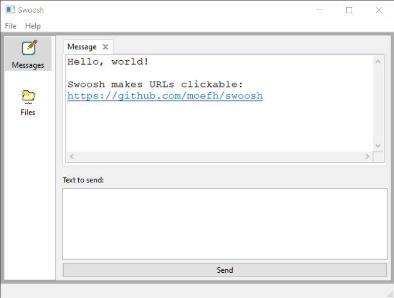

# swoosh

This is a small portable GUI program (using
[wxWidgets](https://www.wxwidgets.org/)) that sends and receives
messages between computers within a local network. It doesn't use a
server and you don't need to mess with IP addresses -- just start it
and you're good to go. It has been tested on Ubuntu (x86_84), Debian
(ARM/Raspberry Pi) and Windows 10.

When you send a message, `swoosh` broadcasts a small UDP packet (the
beacon) announcing the new message for everyone in your local network.
Other instances of `swoosh` in other computers that receive the beacon
then connect to the sender to retrieve the message contents.

By default, `swoosh` uses TCP and UDP ports 5559, and sends small
broadcast packets to UDP port 5559 with every message sent. The port
numbers can be changed in `swoosh_frame.cpp`, and will be
configurable in the UI in the future.

## File Transfers

Swoosh also supports file transfers. To send a file, just go to the
file tab and click "Add file" and select a file in your computer.
This will add a line to the "Sending" list and announce the file to
your local network. To re-announce the file (necessary when someone
starts swoosh in another computer after you added the file), just
double-click it.

When a file announcement is received, a line is added to the
"Receiving" list. To download the file, just double-click the line
and select where the file will be saved.

# Compilation

## Linux

On Linux, just make sure you have the development packages for
wxWidgets installed (`libwxgtk3.0-gtk3-dev` on Ubuntu and Debian) and
run `make`.

## Windows

On Windows, I used Visual Studio Community 2022 (although it's also
probably possible to use mingw). To compile using Visual Studio:

- download the windows binaries from the
[wxWidgets site](https://www.wxwidgets.org/downloads/) (headers,
development files and release DLLs)

- extract the packages on some directory (here I'll call it
`c:\wxwidgets`)

- rename the directory `c:\wxwidgets\lib\vc14x_x64_dll` to
`c:\wxwidgets\lib\vc143_x64_dll` (here "`143`" should be the Windows
SDK version used by your Visual Studio, VS 2022 uses SDK 143)

- add an environment variable on Windows named `wxwin` containing
`c:\wxwidgets`

- add `c:\wxwidgets\lib\vc143_x64_dll` to your PATH environment variable

- open the `swoosh` solution (`swoosh.sln`) and build it.
